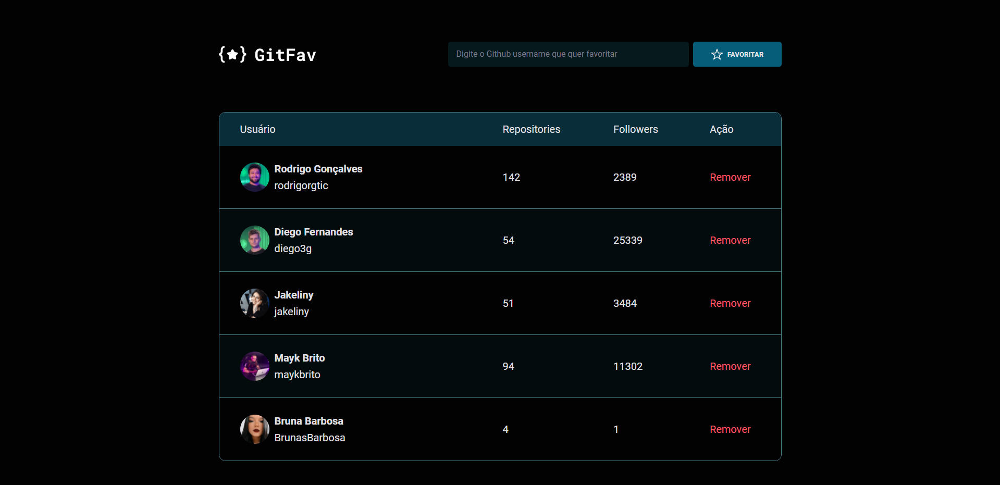
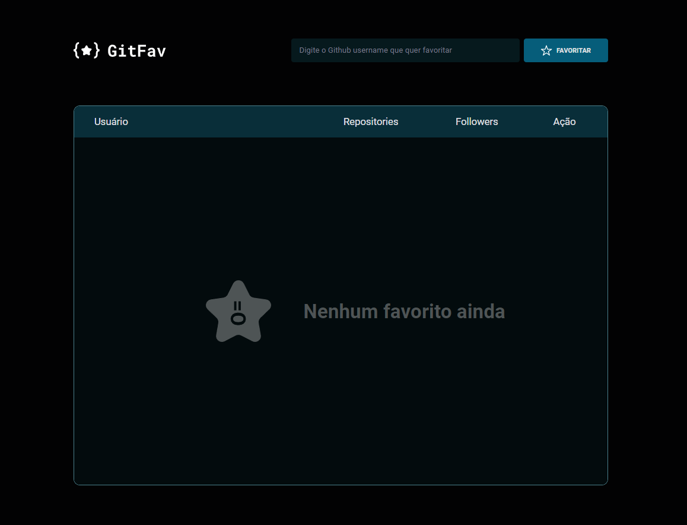
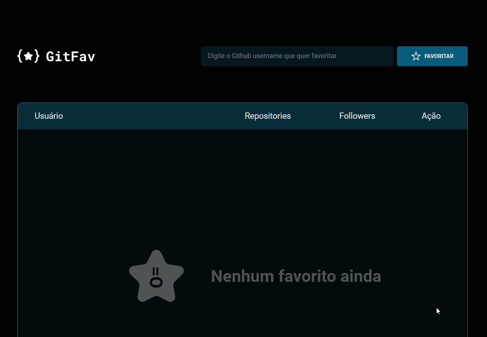
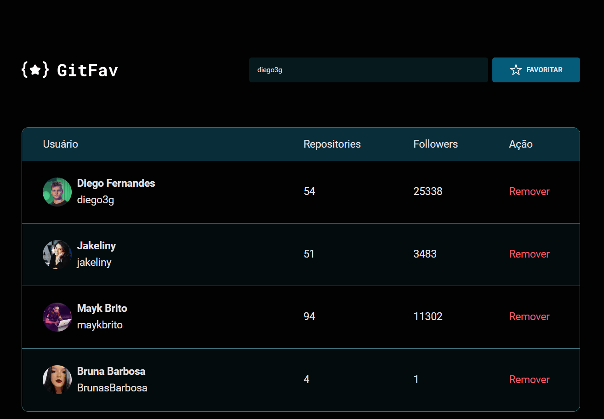
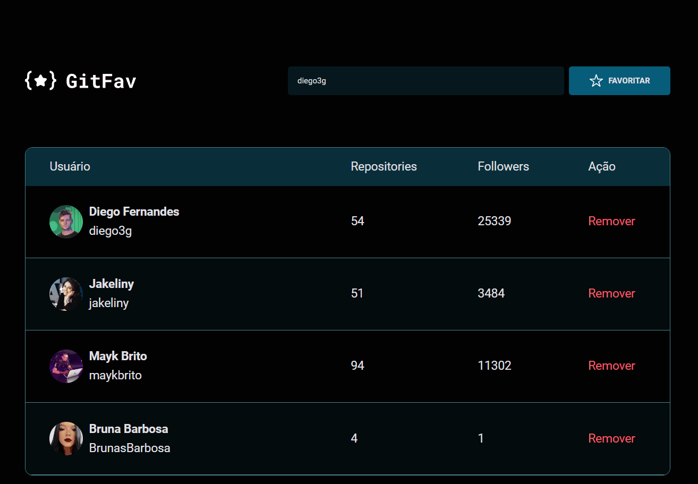
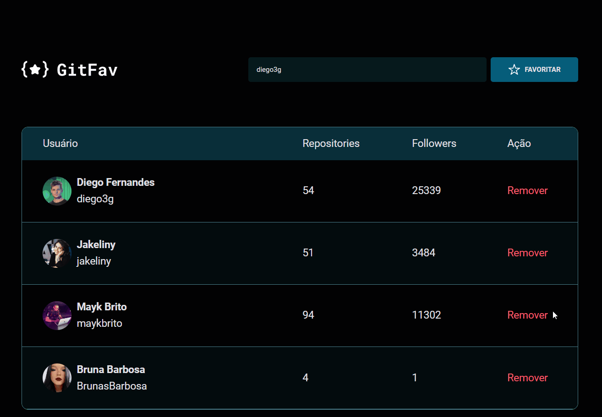

# GitFav

##
> Table, API and logic

Project developed using HTML tables, API request and applied logic, it aims to save your
favorite GitHub users.

It starts containing only one row in the table, it shows you there isn't any favorite user yet.

##

>Add a new user

In the input field the username must be entered, the "FAVORITE" button will send a request searching for de user in the GitHub's API, if the user is registered on the platform it will be found and will be part of your favorite users.

## 

>User already exists

If you try to add a user that is already part of your favorite list, an alert is triggered warning the user is already among your favorites, preventing duplicate records.

## 

>User doesn't exist

Searching for a username that doesn't exists on the platform, an alert message "User not found" is triggered.

##

>Remove user

The "remove" button fires when the event click happens on that element. An alert is triggered asking if you want to continue the remotion, choose "Ok" to remove or "Cancel" to abort user removal.

##

>Data 

All information is stored locally, within the browser's localStorage.

##

🔗 [Click here to access](https://brunasbarbosa.github.io/GitFav/)

## 

## ⚙️ Technologies

- HTML
- CSS
- JavaScript
- Git and Github

## 💌 Contact me

&nbsp;
&nbsp;
&nbsp;

